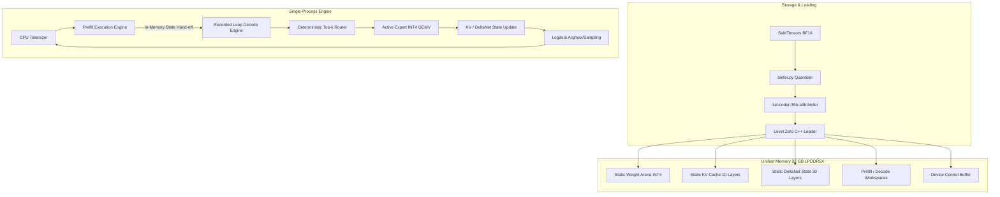

# AInfer: Tiel-Coder-35B-A3B-Genesis-Hermes (Qwen3.5-MoE) Runtime for Intel Core Ultra 7 258V (Arc 140V)

## 1. Objective

Build a lightweight, batch-one inference runtime specialized for the sparse MoE model **`symrex/Tiel-Coder-35B-A3B-Genesis-Hermes-GGUF-dequantized`** (a dequantized SafeTensors fine-tune of the `Qwen3.5-MoE` architecture, GGUF reference release `LuffyTheFox/Tiel-Coder-35B-A3B-Genesis-Hermes-GGUF`) running on the integrated **Intel Arc 140V GPU** of the **Intel Core Ultra 7 258V** processor under **CachyOS**. This is the actual pinned checkpoint (see `target_model_identity.json`); no official `Qwen/Qwen3.6-35B-A3B` repository exists, and earlier planning drafts referencing it are superseded by this identity.

The project migrates and evolves AInfer from its discrete-GPU baseline on Intel Arc Pro B60 (dense hybrid Qwen3.8-27B) into an architecture tailored for:
1. Sparse Mixture-of-Experts (MoE) dynamic routing and active-expert execution.
2. Unified system memory architecture (32 GB LPDDR5X shared between CPU, OS, iGPU, and runtime).
3. Arc 140V (Xe2-LPG) execution resources, SIMD topologies, and memory bandwidth.
4. The CachyOS rolling Linux environment with pinned, reproducible toolchain snapshots.
5. A unified, single-process runtime where chunked prefill and autoregressive decode seamlessly share in-memory state.

The runtime preserves AInfer's core design tenets:
- Model- and hardware-specialized execution (batch 1, text-only, pinned topology).
- Level Zero for low-overhead device memory, queue synchronization, and recorded command lists.
- ESIMD/DP4A/DPAS kernels selected and tuned strictly by empirical microbenchmarking.
- Offline `.binfer` container with deterministic INT4 quantization and independent tensor addressability.
- Static memory allocation without dynamic device allocations during inference.
- Strict evidence-based acceptance gates for correctness, quality, and performance.

---

## 2. Target Hardware & Platform Specification

### 2.1 Hardware Identity
- **Processor:** Intel Core Ultra 7 258V (Lunar Lake package).
- **Integrated GPU:** Intel Arc 140V (Xe2 architecture, 8 Xe-cores, 64 Vector Engines, 2 Intel XMX engines per Xe-core).
- **System Memory:** 32 GB LPDDR5X-8533 on-package memory (unified memory pool shared between CPU and iGPU).
- **Peak Memory Bandwidth:** Theoretical ~136.5 GB/s (planning sustained target: 90–115 GB/s, subject to thermal steady-state measurement).
- **Thermal Design Power (TDP):** 17 W nominal / up to 37 W PL2 (platform dependent).

### 2.2 Software Environment
- **Operating System:** CachyOS (Arch-based rolling distribution, optimized kernel).
- **Compute Driver:** Intel Compute Runtime (`intel-compute-runtime` / NEO) with Level Zero loader (`libze_loader.so.1`).
- **Compiler Stack:** oneAPI DPC++/C++ compiler (`icpx`), Intel Graphics Compiler (`intel-graphics-compiler`).
- **Reproducibility Mechanism:** Pinned local package cache, locked container/chroot rootfs, and tested rollback procedures.

---

## 3. Target Model Specification (Tiel-Coder-35B-A3B-Genesis-Hermes, Qwen3.5-MoE architecture)

*Note: Values below are verified against the pinned checkpoint's `config.json` (captured in
`target_model_identity.json` during Phase 0 / T0.1). Full per-tensor SafeTensors-header
verification (exact shapes, dtypes, byte offsets for every tensor) remains the formal Phase 2 /
T2.2 manifest deliverable; only that remains "pending," not the architecture-level figures below.*

| Parameter | Verified Value | Verification Source |
|---|---|---|
| Total Parameters | ~36.0 Billion (71.96 GB declared BF16 payload ÷ 2 bytes) | `target_model_identity.json` / `model.safetensors.index.json` |
| Active Parameters per Token | ~3 Billion (derived from 8 active experts of 256; exact accounting pending Phase 2) | Model architecture spec |
| Text Trunk Layers | 40 layers total | `config.json` (`text_config.num_hidden_layers`) |
| Layer Breakdown | 30 linear-attention (DeltaNet-style) + 10 full-attention layers, full-attention interval 4 | `config.json` (`text_config.layer_types`) |
| Hidden Dimension ($d_{model}$) | 2048 | `config.json` |
| MoE Experts Total | 256 routed experts | `config.json` (`num_experts`) |
| Active Experts ($k$) | 8 active experts per token | `config.json` (`num_experts_per_tok`) |
| Shared Experts | Present (`shared_expert_intermediate_size` = 512) | `config.json` |
| Attention Topology | 10 full-attention layers, GQA (16 query heads / 2 KV heads, head_dim 256) | `config.json` |
| Linear Attention Topology | 30 DeltaNet-style recurrent layers, FP32 SSM state (`mamba_ssm_dtype: float32`) | `config.json` |
| Quantization Policy | INT4 symmetric group-128, BF16 scales | `.binfer` specification |
| Vocabulary Size | 248,320 tokens | `config.json` / `tokenizer.json` |
| Auxiliary Heads | MTP head present (`mtp_num_hidden_layers: 1`); evaluation remains deferred per Phase 10 (T10.1) | `config.json` |
| Vision Tower | Present in checkpoint (`vision_config`: SigLIP-style, hidden 1152, depth 27) — **excluded from the v1 text-only `.binfer` export** | `config.json` |
| Scope | Batch 1, text-only, greedy + sampling | Project contract |

---

## 4. Scope and Context Tiers

### 4.1 Scope Boundaries
- **In-Scope:** Text generation, batch size 1, greedy and top-k/top-p sampling, single-process prefill-to-decode in-memory execution, Level Zero recorded command lists, deterministic INT4 conversion.
- **Out-of-Scope (v1):** Continuous batching, multi-batch serving, vision encoder (deferred), native multi-hundred-thousand context (deferred), speculative MTP decoding (re-deferred pending explicit criteria).

### 4.2 Staged Context Tiers
1. **Tier 1 (4K): Correctness & Smoke Tier.** Primary target for initial end-to-end verification, deterministic agreement, and regression checking.
2. **Tier 2 (16K): Integration Tier.** Exercises chunked prefill across multiple chunks with unified in-memory transition to decode.
3. **Tier 3 (32K): Memory & Performance Tier.** Tests memory budgeting and sustained throughput under realistic multi-thousand token contexts.
4. **Tier 4 (64K): Stretch Tier.** Gated strictly on measured memory safety margins (preventing page-thrashing and OS OOM) and acceptable prefill latency.

---

## 5. Architectural Validation Gates

### Gate A: Target Hardware & Software Stack (Phase 1)
- Exact PCI ID, EU/Vector Engine counts, subgroup sizes, and feature flags enumerated via Level Zero.
- Memory allocation policies evaluated: `zeMemAllocDevice` vs `zeMemAllocShared` vs host-visible.
- **Concurrent CPU/GPU Contention:** Dedicated benchmark quantifying the impact of concurrent CPU tokenization/host processing on iGPU weight streaming bandwidth.
- Toolchain pinned with verified rollback/reproduction procedure.

### Gate B: Model Topology & Memory Fit (Phase 2)
- Machine-readable manifest (`manifest.json`) generated by direct inspection of SafeTensors headers.
- Measured memory budget generated accounting for:
  - All expert weights in INT4 (all 35B weights must reside in RAM, not just active 3B).
  - Scales, offsets, and shared/dense parameters.
  - Full-attention KV cache (10 layers only).
  - DeltaNet FP32 state (30 layers).
  - Prefill and decode activation workspaces.
  - OS, CPU runtime, filesystem cache, and driver reserve (target minimum 6–8 GB headroom on 32 GB system).

### Gate C: MoE Container & Quantization Integrity (Phase 3)
- MoE metadata extension designed without bloating standard 192-byte directory entries.
- INT4 conversion verified with per-expert and per-layer error distributions.
- Python and C++ loaders validate all expert tables, routing dimensions, and payload checksums.
- Rejection suite validates failure on malformed metadata, truncated payloads, or out-of-bound expert IDs.

### Gate D: Kernel Parity & Dispatch Strategy (Phase 4)
- Deterministic router validated against CPU reference (exact expert selection).
- Expert dispatch strategy selected by empirical shootout:
  1. Host readback + expert list submission.
  2. Device-side indirect command dispatch.
  3. Fixed recorded command list with guarded expert kernels.
- INT4 DP4A/ESIMD GEMV retuned for Arc 140V Xe-cores.
- DeltaNet recurrent/conv arithmetic and full-attention kernels match reference outputs.

---

## 6. Runtime Architecture

### 6.1 Single-Process In-Memory Pipeline
Unlike early prototypes with separate executables and file-based cache handoffs:
- One persistent process loads the model once and binds Level Zero device arenas.
- Chunked prefill writes directly into the decode-layout KV and DeltaNet state buffers.
- Decode loop executes directly from the terminal prefill position without data copying or serialization.
- File-based cache handoff remains purely as an optional diagnostic tool for offline debugging.

### 6.2 Recorded Decode Execution
- Autoregressive decode steps execute via pre-recorded Level Zero command lists.
- Mutable step parameters (step index, sequence position, temperature, router controls) update through a fixed device-mapped control buffer.
- Host overhead per token is minimized to command list submission, queue synchronization, and reading the single sampled token ID.

---

## 7. Quality and Verification Plan

### 7.1 Reference Hierarchy
- Streamed CPU BF16 forward reference implementation for ground-truth logits.
- Single DeltaNet-MoE and Full-Attention-MoE reference blocks.
- Exact routing logit and top-$k$ expert selection verification.

### 7.2 200+ Case Quality Corpus
A frozen test suite across seven core evaluation domains:
1. **Factual & Instruction Following (40 cases):** Accuracy against fixed evaluation rubrics.
2. **Arithmetic & Multi-Step Reasoning (40 cases):** Final numerical answer exact matching.
3. **Code Generation & Syntax (30 cases):** Syntax verification and unit test execution.
4. **Summarization & Rewriting (20 cases):** Rubric-scored coherence and extraction fidelity.
5. **Multilingual English & Chinese (30 cases):** Translation, reasoning, and tokenization parity.
6. **Long Free Generation (20 cases):** Repetition penalties, EOS stability, finite logits over 256 tokens.
7. **Long-Context Retrieval (20 cases):** Multi-depth needle-in-a-haystack and distractor tests.

---

## 8. Performance and Roofline Strategy

### 8.1 Measured Active Traffic Roofline
Roofline limits must not assume an idealized 3B parameter transfer. Bandwidth demand must be computed from:
$$\text{Traffic} = W_{\text{active\_experts}} + W_{\text{shared\_dense}} + W_{\text{routing}} + W_{\text{scales}} + T_{\text{KV}} + T_{\text{DeltaNet}} + T_{\text{activations}}$$
Actual measured bytes transferred over system memory buses must be compared against logical requirements.

### 8.2 Thermal and Steady-State Profiling
Benchmarks on the Lunar Lake platform must report cold-start, warm-start, and sustained thermally steady performance (at least 5 minutes of continuous generation) to account for dynamic clock scaling and SoC power throttling.

---

## 9. Migration Milestones

| Milestone | Phase | Key Milestone Deliverable |
|---|---|---|
| **M0: Migration Contract** | Phase 0 | Pinned target identities, context tiers, acceptance criteria, feasibility report |
| **M1: Platform Ready** | Phase 1 | CachyOS toolchain locked, L0 probe green, unified memory & contention profiled |
| **M2: Model Fits & Loads** | Phases 2 & 3 | Verified manifest, memory budget, MoE `.binfer` container, C++ loader validated |
| **M3: Kernels Correct** | Phase 4 | Router, expert GEMV, DeltaNet, and Attention verified against references |
| **M4: Unified Runtime** | Phase 5 | Single-process prefill-to-decode working with static arena allocation |
| **M5: Quality Qualified** | Phase 6 | 200-case quality corpus and long-context needle tests meet pass criteria |
| **M6: Performance Characterized**| Phase 7 | Steady-state roofline, latency breakdowns, and llama.cpp SYCL comparison |
| **M7: Service Candidate** | Phase 8 | Persistent HTTP daemon with request isolation, queueing, and recovery |

---

## 10. Definition of Done

The AInfer 258V migration is complete when:
1. Pinned Tiel-Coder-35B-A3B-Genesis-Hermes (Qwen3.5-MoE) model converts deterministically to `.binfer` and loads into static Level Zero memory.
2. Peak system memory remains safely below physical RAM capacity across the release context tier without triggering swapping.
3. Router decisions and operator outputs match trusted CPU references within defined numerical tolerances.
4. Prefill and decode operate in a single process sharing in-memory KV and DeltaNet state.
5. The 200-case quality test suite passes with zero catastrophic divergences.
6. Independent, thermally steady prefill tokens/s, cold/warm TTFT, and decode tokens/s are documented and published.
7. The persistent HTTP service passes 10-request sequential stress and cancellation tests without memory leaks.
